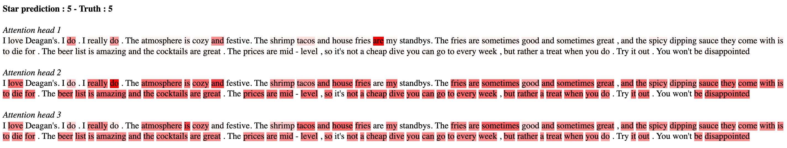
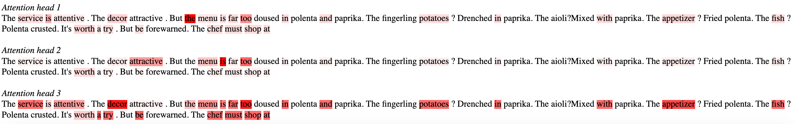

# Text Classification using Self-Attentive Sentence Embedding

Implementation of [_A Structured Self-Attentive Sentence Embedding_](https://arxiv.org/pdf/1703.03130.pdf) by Lin et al., 2017 with my own words embedding from an implementation of the W2V CBOW algorithm.

## Data

The implementation is performed on a part of Yelp reviews, availables [here](https://www.yelp.com/dataset/download).

## Results

Here are partial results of the implementation with 3 attention heads. Highlighted words are considered as the most importants by the attention head to predict the rating.

